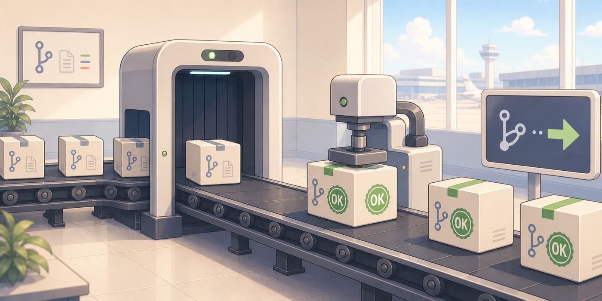

# pr-seal-action

<p align="center">
  
</p>

`pr-seal-action` verifies that a pull request was created by an expected author and only changes allowed files, then seals it by approving it and either enabling auto-merge or merging it with the verified head SHA.

This action is for tightly scoped automation PRs such as generated changelog updates. It is not a general-purpose auto-approve action.

## What It Does

1. Fetches the target pull request.
2. Requires the pull request to be open.
3. Fetches every changed file with GitHub API pagination bound to a stable GraphQL `headRefOid` before approval.
4. Requires the PR author login to exactly match `expected-author`.
5. Requires every changed file path to exactly match one of `allowed-paths`.
6. Captures the verified pull request node ID and head SHA.
7. Creates an approval review with `approve-token` against the verified head SHA.
8. Enables auto-merge with `merge-token` and `expectedHeadOid` set to the verified head SHA.
9. If GitHub rejects auto-merge because the PR is already in clean status, directly merges the PR with the same verified head SHA and merge method.

If any verification or privileged operation fails, the action fails closed.

## What It Does Not Do

- It does not create GitHub App tokens.
- It does not create pull requests.
- It does not generate changelogs.
- It does not define workflow triggers.
- It does not delete the source branch after merge.
- It does not replace branch protection, required reviews, required checks, or repository auto-merge settings.

Use repository automatic head branch deletion or a separate cleanup workflow if branch cleanup is required.

## Inputs

| Name | Required | Default | Description |
| --- | --- | --- | --- |
| `repository` | No | Current repository | Repository in `owner/name` format. |
| `pull-request-number` | Yes |  | Pull request number to verify, approve, and enable auto-merge or merge. |
| `expected-author` | Yes |  | Exact GitHub login expected for the PR author, for example `app/y-writings-pr-creator-bot`. |
| `allowed-paths` | Yes |  | Newline-separated exact file paths the PR may change. Glob syntax is not supported. |
| `approve-token` | Yes |  | Token used only to create the approval review. |
| `merge-token` | Yes |  | Token used to read the PR, enable auto-merge, or merge the PR. |
| `merge-method` | No | `squash` | Merge method. One of `squash`, `merge`, or `rebase`. |
| `approve-body` | No | Automated verification message | Body for the approval review. |

## Outputs

| Name | Description |
| --- | --- |
| `pull-request-id` | GraphQL node ID of the verified pull request. |
| `head-sha` | Verified pull request head SHA. |
| `changed-files` | JSON array of changed file paths considered during verification. |
| `approved` | `true` when an approval review was created. |
| `auto-merge-enabled` | `true` when auto-merge was enabled. |
| `merged` | `true` when the PR was merged directly because GitHub reported it was already clean. |

## Example

```yaml
- name: Verify, approve, and enable auto-merge
  uses: y-writings/pr-seal-action@v1
  with:
    repository: ${{ github.repository }}
    pull-request-number: ${{ steps.changelog-pull-request.outputs.pull-request-number }}
    expected-author: app/y-writings-pr-creator-bot
    allowed-paths: |
      CHANGELOG.md
    approve-token: ${{ steps.approver-token.outputs.token }}
    merge-token: ${{ steps.pr-creator-token.outputs.token }}
    merge-method: squash
    approve-body: Automated approval for CHANGELOG.md-only release PR.
```

## Token Guidance

Use separate tokens for approval and auto-merge when branch protection requires review by a different actor.

- `approve-token` should belong to the approver actor and have permission to create pull request reviews.
- `merge-token` should belong to the PR creator or merge actor and have permission to read the PR and enable auto-merge.

The approver actor must differ from the pull request author. When that condition is satisfied, `approve-token` and `merge-token` may be the same token. Use separate tokens if you want to keep the approver token at the minimum permissions needed only for approval.

Do not use broad organization-wide credentials when a repository-scoped GitHub App token is sufficient.

## Security Notes

This action fails when the PR author differs from `expected-author`, when any changed file is outside `allowed-paths`, when the PR is not open, when the PR node ID or head SHA cannot be resolved, when approval fails, or when GitHub rejects both auto-merge enablement and the clean-status direct merge path.

Auto-merge and direct merge are both requested with GitHub GraphQL `expectedHeadOid`. If the PR head changes after verification, GitHub rejects the operation instead of sealing a different commit.
